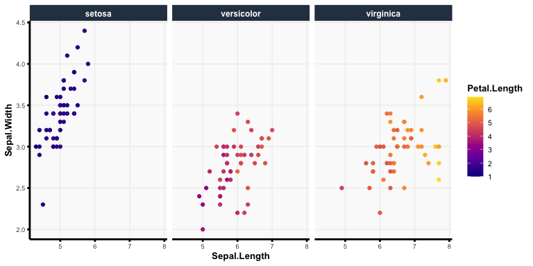

<!-- README.md is generated from README.Rmd. Please edit that file -->

# Welcome to vthemes!

<!-- badges: start -->
<!-- badges: end -->

`vthemes` provides convenient utility functions as well as a clean and
modern theme for `ggplot2` plots and R Markdown documents.

## Installation

You can install the development version of vthemes from
[GitHub](https://github.com/) with:

``` r
devtools::install_github("Yu-Group/vthemes")
```

## Example Usage

``` r
library(vthemes)
library(ggplot2)
```

### The `vmodern` ggplot Theme

The `vmodern` ggplot theme provides a minimalistic but modern style to
`ggplot2` plots with discrete and continuous color schemes that are
heavily built around `viridis` and the “Dark2” palette from
`RColorBrewer`.

``` r
ggplot(iris) +
  aes(x = Sepal.Length, fill = Species) +
  geom_density(alpha = 0.4) +
  theme_vmodern() +
  scale_fill_vmodern(discrete = TRUE)
```


``` r
ggplot(iris) +
  aes(x = Sepal.Length, y = Sepal.Width, color = Petal.Length) +
  facet_wrap(~ Species) +
  geom_point() +
  theme_vmodern() +
  scale_color_vmodern(discrete = FALSE)
```



### The `vmodern` R Markdown Theme

The `vmodern` R Markdown theme is largely based upon the material design
theme from the `rmdformats` R package but has been adapted to maximize
the content spacing, improve tab functionality, and utilize a different
color scheme. To use the `vmodern` theme, set `output: vthemes::vmodern`
in the R Markdown yaml header as follows:

``` yml
---
title: Document Title
author: Tiffany Tang
date: March 04, 2022
output:
  vthemes::vmodern
---
```

[](https://yu-group.github.io/vthemes/articles/examples/vmodern.html)
